# VoyageX ✈️🌍
A premium travel planning platform that turns trip planning into a full 
operating system — budgets, packing, itineraries, journaling, and 
destination discovery, all in one dashboard.

## 🌟 About the Project
VoyageX lets travelers plan every part of a trip in one place instead of 
juggling spreadsheets, notes apps, and booking sites. Add a trip and 
instantly get a live dashboard with countdown, weather, and budget 
tracking. An interactive world map keeps visited, planned, and dream 
destinations color-coded, while a drag-and-drop timeline, category-based 
packing lists, and a private travel journal with photos make it a 
genuine day-to-day travel companion — not just a booking form.

## 📸 Screenshots
| Dashboard | Trip Planner |
|-----------|--------------|
| 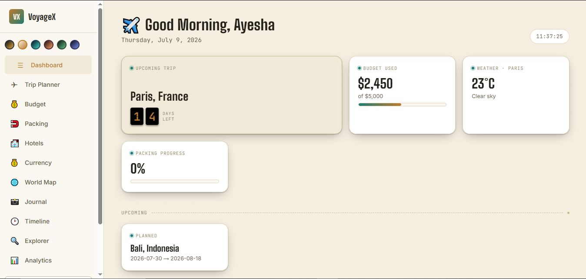 | 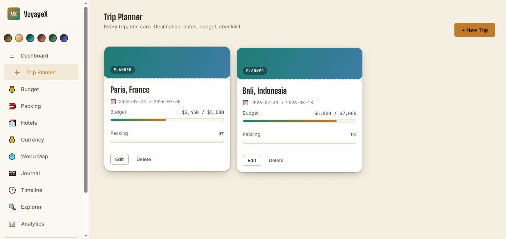 |
| Budget Planner | Smart Packing |
|----------------|---------------|
| 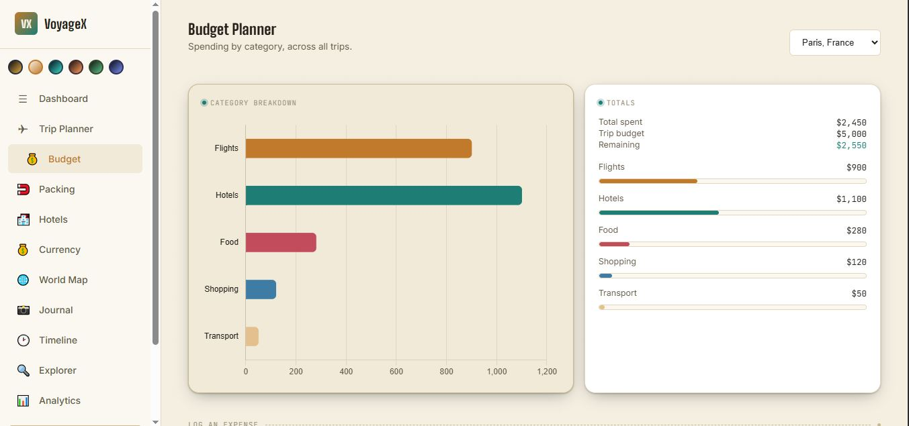 | 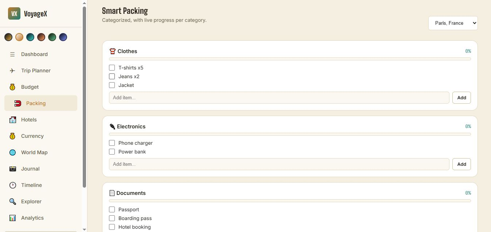 |
| Currency Converter | Hotel Wishlist |
|---------------------|----------------|
| 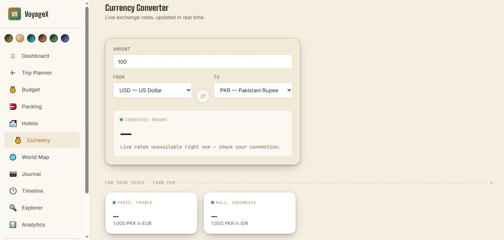 | 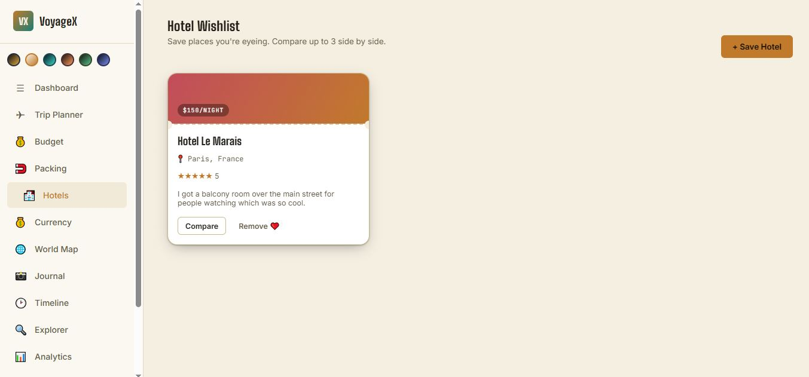 |
| World Map | Travel Journal |
|-----------|----------------|
|  | 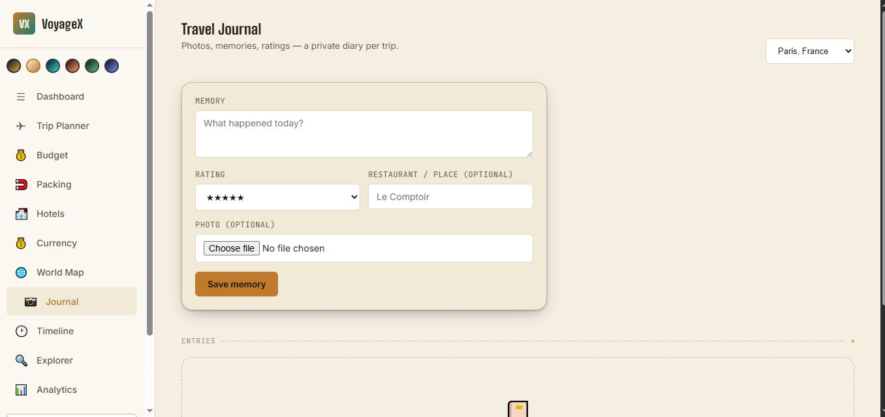 |
| Timeline | Destination Explorer |
|----------|-----------------------|
| 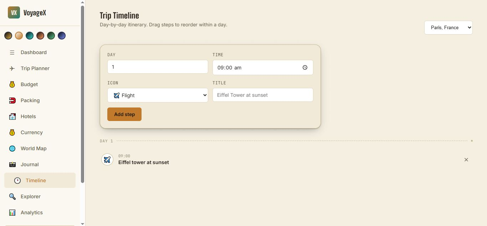 | 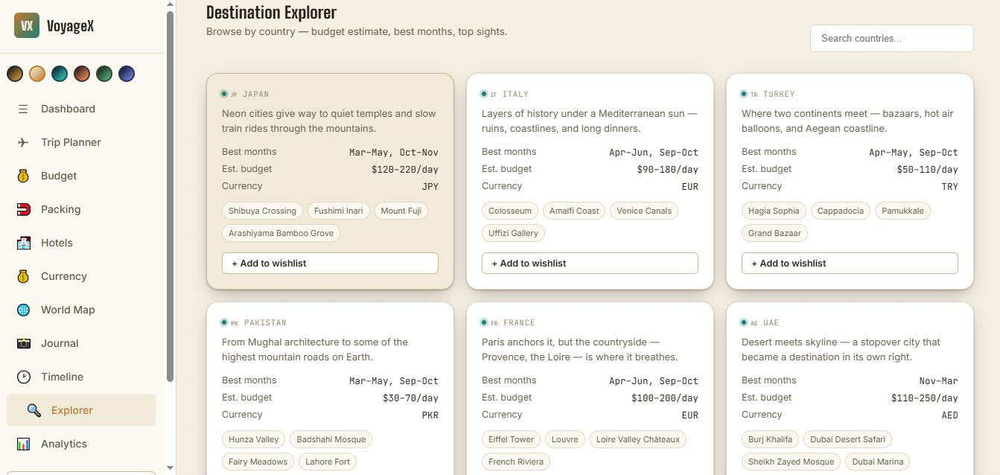 |
| Analytics       | Achievements|
|---------------------------|----------------|
| 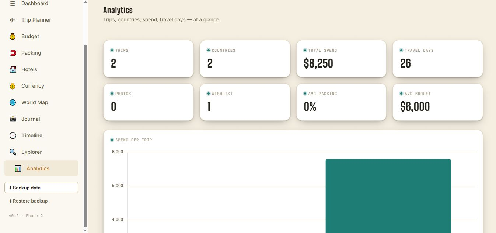 | 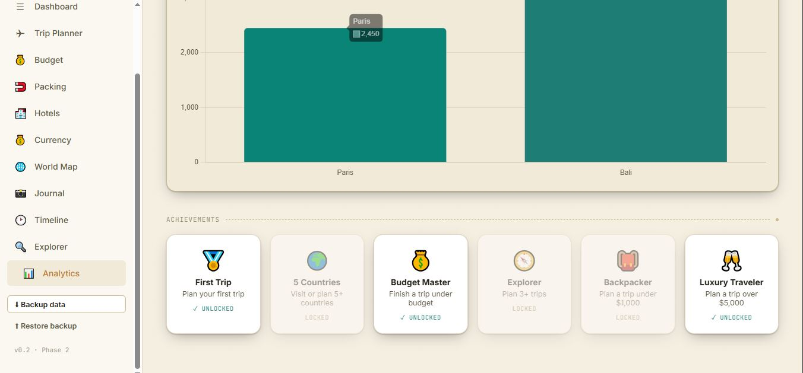 |

## 👩‍💻 Developer
- Ayesha Amjad — Full-Stack Developer (Front-End Focused) & Digital Marketing Specialist

## ✨ Key Features
### 🏠 Dashboard
- Split-flap countdown to next trip
- Live weather via Open-Meteo API
- Budget-used and packing-progress widgets
- Upcoming trips strip

### ✈️ Trip Planner
- Add, edit, and delete trips as boarding-pass-style cards
- Destination, dates, budget, status & notes per trip

### 💰 Budget Planner
- Category-wise expense logging (Flights, Hotels, Food, Shopping, Transport)
- Live Chart.js breakdown per trip
- Remaining balance tracking

### 🧳 Smart Packing
- Categorized checklists (Clothes, Electronics, Documents, Medicine)
- Custom item support with live progress bars per category

### 🌍 Interactive World Map
- Leaflet.js map, color-coded by status: 🟢 Visited · 🟡 Planned · 🔵 Dream
- Click anywhere to reverse-geocode and save a wishlist location

### 📸 Travel Journal
- Private diary per trip — memories, 5-star ratings, restaurant notes
- Photo uploads, auto-compressed client-side

### 🕒 Timeline
- Day-by-day itinerary builder
- Real drag-and-drop reordering within each day

### 🎯 Destination Explorer
- 10 curated country cards with budget estimates, best months & top attractions
- Searchable, with one-click "add to wishlist"

### 📊 Analytics & Achievements
- Trips, countries, total spend, travel days, photos & wishlist stats
- Spend-per-trip chart
- Gamified badges: First Trip, 5 Countries, Budget Master, Explorer, Backpacker, Luxury Traveler

### 💱 Currency Converter
Live exchange rates (via the free Frankfurter API) with a full currency list, instant swap, and a personalized panel showing PKR conversions for each of your trip destinations.

### 🏨 Hotel Wishlist
- Airbnb-style saved-hotel cards — name, location, price/night, star rating, notes
- Select up to 3 hotels and compare them side by side

### 🌙 Themes
- Six color themes — Midnight, Sand, Ocean, Sunset, Forest, Aurora — switchable instantly across the app

### 💾 Backup & Restore
- Export all trip data as a JSON file, restore it back in anytime — insurance against browser storage getting cleared

## 🛠️ Technologies Used
### Frontend


### Data & APIs


## 🚀 Getting Started
```bash
git clone https://github.com/AyeshaCodes25/voyagex.git
cd voyagex
```
Open `index.html` in your browser — no server, no build step, no dependencies to install.

> ⚠️ Keep `index.html` in the same folder as `css/` and `js/` — moving it on its own will break the styles and scripts.

## 👩‍💻 Developer Contact
Ayesha Amjad — Full-Stack Developer (Front-End Focused)
📧 ayeshaamjad819@gmail.com
🔗 github.com/AyeshaCodes25

## 🗺️ Roadmap
- [x] Dashboard, Trip Planner, Budget, Packing
- [x] World Map, Journal, Timeline, Explorer, Analytics, Achievements
- [x] Hotel Wishlist with compare
- [x] Currency converter with live rates
- [x] 6 themes (Midnight, Sand, Ocean, Sunset, Forest, Aurora)
- [x] Backup/restore via JSON export-import
- [x] Responsive layout with off-canvas mobile nav


## 🏫 Academic Context
Built independently as a portfolio project — BS Information Technology, 
GC University Faisalabad.
